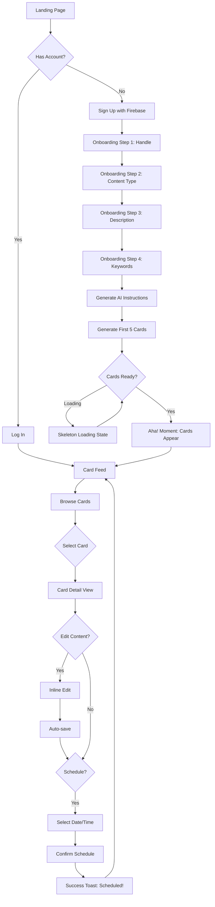
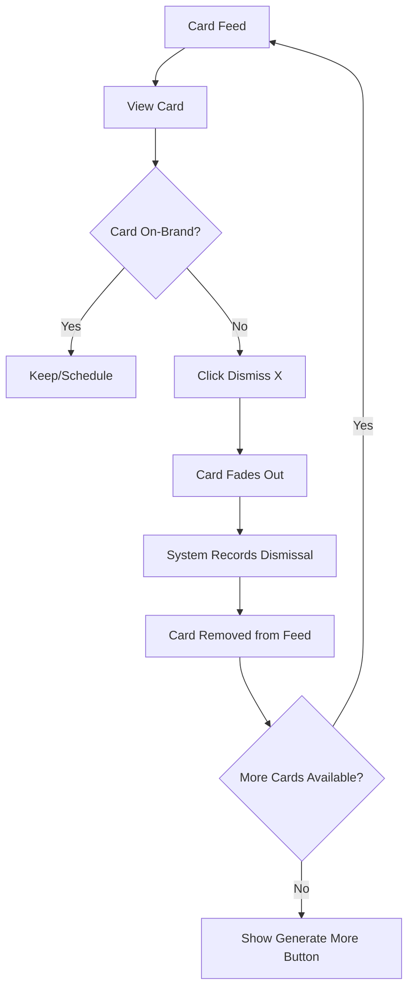
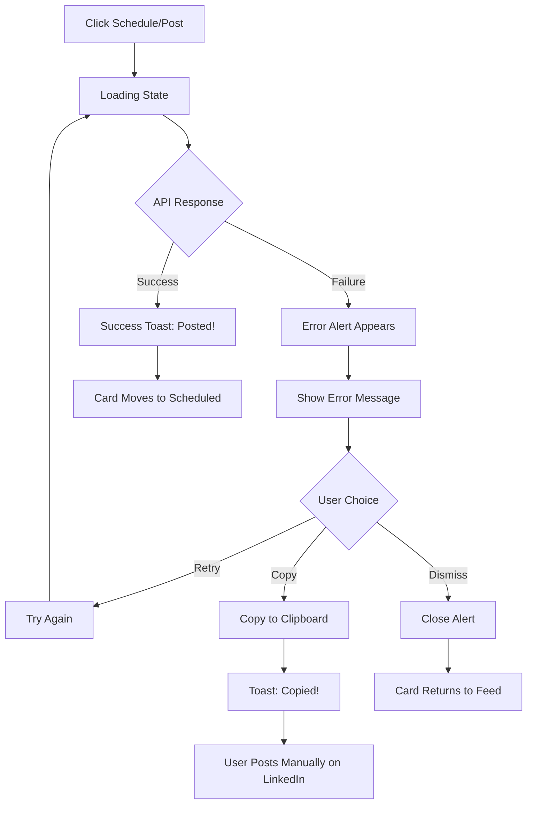
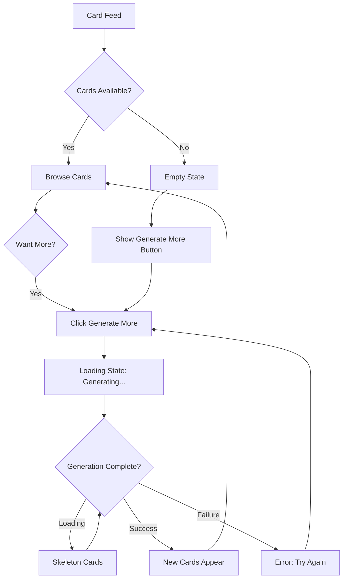

# UX Design Specification - kura-frontend

**Author:** 12jihan
**Date:** 2026-02-02

---

## Executive Summary

### Project Vision

Kura transforms social media content creation from a daily grind into effortless discovery. By delivering AI-generated post ideas that sound authentically like the user, Kura becomes the creative partner solo creators couldn't afford to hire.

### Target Users

**Primary Persona: Alex — The Busy Solo Creator**

- Building a personal brand across social platforms
- Manages content single-handedly alongside core work
- Currently drowning in fragmented tools and blank-screen anxiety
- Needs: Ideas that sound like him, one tool for everything, time back in his day

**User Context:**
- Tech-savvy but time-poor
- Primary device: Desktop (creators work on laptops)
- Usage pattern: Morning routine — check cards, schedule posts, move on
- Success metric: "I haven't stressed about content in over a week"

### Key Design Challenges

1. **First Impression Magic** — AI-generated cards must immediately feel on-brand; generic output breaks trust
2. **Zero-Friction Flow** — Browse → Edit → Schedule must feel effortless, like browsing not working
3. **Error Recovery** — LinkedIn API failures must never block users; graceful degradation required
4. **Empty States** — "Out of cards" should feel like opportunity, not limitation

### Design Opportunities

1. **"Aha!" Moment Delivery** — Design the first card reveal for maximum delight and recognition
2. **Card-as-Canvas** — Treat cards as creative artifacts worth exploring, not list items to process
3. **Calm Confidence** — UI should communicate "your content is handled" and reduce posting anxiety

---

## Core User Experience

### Defining Experience

**The Core Loop:**
Browse → Select → Edit (optional) → Schedule/Post

Kura's UX must make this loop feel like browsing a curated feed, not operating a tool. The cognitive load should be on creative choice ("which idea resonates?"), not on mechanics ("how do I use this?").

**Primary User Action:** Card browsing and selection
**Critical User Action:** First card reveal experience
**Effortless Target:** From "I need content" to "It's scheduled" in under 5 minutes

### Platform Strategy

| Platform | Decision | Rationale |
|----------|----------|-----------|
| **Primary** | Web SPA | Creators work in browsers alongside their platforms |
| **Framework** | Angular 21 | Modern signals, excellent performance |
| **Primary Device** | Desktop | Content creation happens on laptops |
| **Input Mode** | Mouse/keyboard | Precision editing, quick navigation |
| **Mobile Support** | Responsive | Check cards on-the-go, but not primary workflow |
| **Offline** | Not required | Content posting requires connectivity anyway |

### Effortless Interactions

| Interaction | Effortless Design |
|-------------|-------------------|
| **Card Browsing** | Scroll feed, visual scanning, no clicks required to preview |
| **Card Selection** | Single click to expand/select |
| **Quick Edit** | Inline text editing, no modal, no save button — auto-saves |
| **Scheduling** | One-click schedule with smart defaults |
| **Dismiss** | Single click, instant removal, no confirmation needed |
| **Regenerate** | One-click, new card appears in place |

### Critical Success Moments

1. **First Card Reveal (Onboarding)** — The 5 cards must immediately feel on-brand. This is the "Aha!" moment that validates the entire product promise.

2. **Edit → Schedule Flow** — Tweaking text and scheduling should feel like a single fluid action, not two separate tasks.

3. **Daily Return** — Opening Kura each morning to find fresh, relevant cards waiting. The relief of "content is handled."

4. **Error Recovery** — When LinkedIn fails, the user never feels stuck. Copy-to-clipboard appears instantly, retry is available, anxiety stays low.

### Experience Principles

1. **Browse, Don't Work** — The interface should feel like discovering content, not creating it
2. **Trust Through Quality** — Every card must feel worth considering; off-brand content erodes trust
3. **One-Click Everything** — Core actions require exactly one click; never two
4. **Calm Over Busy** — Communicate "handled" not "look how much we're doing"
5. **Graceful Degradation** — Failures have instant fallbacks; users are never blocked

---

## Desired Emotional Response

### Primary Emotional Goals

| Goal | Description |
|------|-------------|
| **Relief** | "I don't have to stress about content anymore" — the weight lifts |
| **Recognition** | "This actually sounds like me" — trust in AI quality |
| **Calm Confidence** | "My content is handled" — quiet assurance, not frantic productivity |
| **Empowerment** | "I can focus on my real work now" — time reclaimed |

### Emotional Journey Mapping

| Stage | Emotion | UX Support |
|-------|---------|------------|
| **First Visit** | Curiosity + Hope | Clean value proposition, easy entry |
| **Onboarding** | Confidence + Control | Guided steps, clear progress |
| **First Card Reveal** | Surprise + Recognition | The "Aha!" moment — highlight quality |
| **Daily Return** | Calm + Anticipation | Fresh cards waiting, morning ritual |
| **Card Browsing** | Discovery + Interest | Feed feels like browsing, not working |
| **Editing** | Ownership + Control | Quick tweaks, my voice comes through |
| **Scheduling** | Accomplishment + Relief | Done! Tomorrow is handled |
| **Error State** | Reassurance + Agency | Never stuck, clear fallback |

### Micro-Emotions

**Build These:**
- **Trust** — Cards consistently feel on-brand; dismiss rate stays low
- **Confidence** — Every action is obvious; zero "what now?" moments
- **Delight** — Occasional perfect card that exceeds expectations
- **Accomplishment** — Clear sense of "done" after scheduling

**Prevent These:**
- **Skepticism** — Generic output that doesn't sound like the user
- **Frustration** — Hidden controls, unclear actions, slow responses
- **Anxiety** — Errors without fallbacks, uncertainty about post status
- **Overwhelm** — Too many options, features, or decisions

### Design Implications

| Emotion | Design Choice |
|---------|--------------|
| **Relief** | Calm visual design, no urgent colors or notifications |
| **Recognition** | First cards must be exceptional; invest in onboarding-to-generation flow |
| **Confidence** | One-click actions, visible system status, smart defaults |
| **Accomplishment** | Clear "scheduled" confirmation, visual feedback on completion |
| **Reassurance** | Instant fallback buttons, copy-to-clipboard always visible on errors |

### Emotional Design Principles

1. **Calm Over Busy** — The UI whispers "handled" instead of shouting "look at all this!"
2. **Recognition Before Features** — First impression is about "this sounds like me" not "look what you can do"
3. **Earned Delight** — Occasional surprise moments, but never at the expense of reliability
4. **Graceful Recovery** — Errors are acknowledged calmly with immediate solutions
5. **Quiet Accomplishment** — Completion states are satisfying but not over-celebratory

---

## UX Pattern Analysis & Inspiration

### Inspiring Products Analysis

| Product | What They Do | Key UX Lessons for Kura |
|---------|-------------|------------------------|
| **Curator.io** | Social media aggregator | Minimalist, content-first design; purple accent creates modern feel; progressive disclosure for complexity |
| **Social Curator** | AI content manager | "In your voice" promise front-and-center; fast generation time highlighted; social proof with metrics |
| **Quuu** | Social growth tool | Professional credibility through clean typography; data-driven appeals to power users |

### Transferable UX Patterns

**Navigation & Layout:**
- Minimalist header with clear primary actions
- Content-first layouts — UI recedes, content shines
- Progressive disclosure on mobile — hide complexity until needed
- Generous whitespace signals calm, premium experience

**AI Voice Matching (from Social Curator):**
- Promise "content in your voice" prominently in onboarding
- Show generation speed as a feature ("cards in under 10 seconds")
- Let first card reveal prove the promise immediately

**Trust & Credibility:**
- Social proof with specific metrics (not vague testimonials)
- Professional typography hierarchy builds confidence
- Clear, visible pricing/value proposition reduces anxiety

**Visual Design:**
- Clean sans-serif typography (Inter, Plus Jakarta Sans)
- Accent color for interactive elements (purple/blue tones)
- Light backgrounds with strategic color pops
- Modern but approachable — not cold or corporate

### Anti-Patterns to Avoid

| Anti-Pattern | Why to Avoid | Kura Alternative |
|--------------|--------------|------------------|
| **Feature overload on homepage** | Overwhelms new users; conflicts with "calm" goal | Focus on core loop: Browse → Edit → Schedule |
| **Generic AI promises** | "AI-powered" means nothing; sounds like every competitor | Specific promise: "Cards that sound like you" |
| **Hidden pricing/value** | Creates anxiety; users wonder "what's the catch?" | Transparent value proposition upfront |
| **Complex onboarding** | Busy creators abandon lengthy setup flows | Minimal inputs → immediate card generation |
| **Dashboard-heavy design** | Feels like work, not discovery | Feed-based browsing; dashboard is secondary |

### Design Inspiration Strategy

**Adopt Directly:**
- Minimalist, content-first aesthetic (Curator.io)
- "In your voice" promise prominence (Social Curator)
- Clean typography hierarchy (Quuu)
- Purple/blue accent color palette

**Adapt for Kura:**
- Social Curator's "Dottie" personality → Kura's calm, capable AI (less personified, more invisible)
- Curator's aggregation feed → Kura's card-based content feed (same pattern, different content type)
- Quuu's data-driven messaging → Kura's "5 cards, under 10 seconds" specificity

**Avoid:**
- Social Curator's community/education features — Kura stays focused on generation
- Dashboard-centric navigation — Kura leads with the feed
- Feature-heavy landing pages — Kura shows value immediately

---

## Design System Foundation

### Design System Choice

**Approach:** Fully Custom Design System

Kura uses a bespoke design system built from scratch, giving complete control over the calm, modern aesthetic that differentiates it from competitors.

| Decision | Choice | Rationale |
|----------|--------|-----------|
| **Styling** | SCSS with BEM methodology | Maintainable, scalable CSS architecture; clear naming conventions |
| **Icons** | Lucide Icons | Modern, consistent icon set; lightweight; MIT licensed |
| **Components** | Custom-built | No framework bloat; exact match to design vision |
| **Theme** | Dark theme | Reduces eye strain for daily users; modern aesthetic |
| **Accent** | Thin purple borders | Distinctive visual signature; calm but defined |

### Rationale for Selection

1. **Full Design Control** — Kura's calm, content-first aesthetic requires precise visual tuning that pre-built frameworks can't deliver
2. **No Bloat** — Solo dev building only what's needed; no unused component weight
3. **BEM Scalability** — Clear `.block__element--modifier` naming prevents CSS conflicts as app grows
4. **Dark Theme Default** — Aligns with modern tool aesthetic; easier on eyes for daily morning routine
5. **Purple Accent Identity** — Thin purple borders create recognizable visual signature without overwhelming content

### Implementation Approach

**SCSS Architecture:**
```
styles/
├── _variables.scss      # Colors, spacing, typography tokens
├── _mixins.scss         # Reusable patterns (borders, shadows)
├── _reset.scss          # CSS reset/normalize
├── _typography.scss     # Font definitions, scales
├── _utilities.scss      # Helper classes
├── components/          # BEM component styles
│   ├── _card.scss
│   ├── _button.scss
│   ├── _input.scss
│   └── ...
└── main.scss            # Entry point
```

**BEM Naming Convention:**
```scss
// Block
.card { }

// Element
.card__header { }
.card__content { }
.card__actions { }

// Modifier
.card--selected { }
.card--dismissed { }
```

**Lucide Icons Integration:**
- Install: `npm install lucide-angular`
- Tree-shakeable — only imports icons used
- Consistent stroke width matches thin border aesthetic

### Customization Strategy

**Design Tokens (SCSS Variables):**

```scss
// Color Palette
$color-bg-primary: #0D0D0F;        // Deep dark background
$color-bg-secondary: #1A1A1E;      // Card/surface background
$color-bg-tertiary: #252529;       // Elevated surfaces

$color-border-accent: #8B5CF6;     // Purple accent borders
$color-border-subtle: #2A2A2E;     // Subtle dividers

$color-text-primary: #F4F4F5;      // Primary text
$color-text-secondary: #A1A1AA;    // Secondary text
$color-text-muted: #71717A;        // Muted/disabled text

$color-accent-primary: #8B5CF6;    // Purple primary accent
$color-accent-hover: #A78BFA;      // Purple hover state
$color-success: #22C55E;           // Success states
$color-error: #EF4444;             // Error states

// Borders
$border-width-thin: 1px;
$border-radius-sm: 4px;
$border-radius-md: 8px;
$border-radius-lg: 12px;

// Spacing Scale
$spacing-xs: 4px;
$spacing-sm: 8px;
$spacing-md: 16px;
$spacing-lg: 24px;
$spacing-xl: 32px;

// Typography
$font-family-primary: 'Inter', system-ui, sans-serif;
$font-size-sm: 0.875rem;
$font-size-base: 1rem;
$font-size-lg: 1.125rem;
$font-size-xl: 1.25rem;
```

**Card Component Example:**

```scss
.card {
  background: $color-bg-secondary;
  border: $border-width-thin solid $color-border-subtle;
  border-radius: $border-radius-md;
  padding: $spacing-lg;
  transition: border-color 0.2s ease;

  &:hover {
    border-color: $color-border-accent;
  }

  &--selected {
    border-color: $color-border-accent;
    box-shadow: 0 0 0 1px $color-border-accent;
  }

  &__header {
    margin-bottom: $spacing-md;
  }

  &__content {
    color: $color-text-primary;
    line-height: 1.6;
  }

  &__actions {
    display: flex;
    gap: $spacing-sm;
    margin-top: $spacing-lg;
  }
}
```

### Angular Component Organization

**File Structure Standard:**

Each Angular component follows strict separation of concerns with dedicated files:

```
components/
└── card/
    ├── card.component.ts        # Component logic
    ├── card.component.html      # Template markup
    └── card.component.scss      # BEM styles
```

**Angular CLI Configuration (angular.json):**
```json
{
  "schematics": {
    "@schematics/angular:component": {
      "inlineStyle": false,
      "inlineTemplate": false,
      "style": "scss",
      "skipTests": false
    }
  }
}
```

**Component Generation:**
```bash
ng generate component components/card
# Creates:
#   card.component.ts
#   card.component.html
#   card.component.scss
#   card.component.spec.ts
```

**Example Component Structure:**

```typescript
// card.component.ts
@Component({
  selector: 'app-card',
  templateUrl: './card.component.html',
  styleUrls: ['./card.component.scss'],
  standalone: true,
  imports: [CommonModule, LucideAngularModule]
})
export class CardComponent {
  // Component logic only
}
```

```html
<!-- card.component.html -->
<article class="card" [class.card--selected]="selected">
  <header class="card__header">
    <ng-content select="[card-title]"></ng-content>
  </header>
  <div class="card__content">
    <ng-content></ng-content>
  </div>
  <footer class="card__actions">
    <ng-content select="[card-actions]"></ng-content>
  </footer>
</article>
```

```scss
// card.component.scss
@use '../../styles/variables' as *;

.card {
  background: $color-bg-secondary;
  border: $border-width-thin solid $color-border-subtle;
  // ... BEM styles
}
```

**Folder Organization:**
```
src/
├── app/
│   ├── components/          # Shared/reusable components
│   │   ├── card/
│   │   ├── button/
│   │   └── input/
│   ├── features/            # Feature modules
│   │   ├── onboarding/
│   │   ├── feed/
│   │   └── scheduling/
│   └── layouts/             # Layout components
│       ├── main-layout/
│       └── auth-layout/
├── styles/                  # Global SCSS
│   ├── _variables.scss
│   ├── _mixins.scss
│   └── main.scss
└── assets/
```

---

## Defining Experience

### The Core Interaction

**Kura's Defining Experience:**
> "See AI-generated cards that actually sound like you"

This single interaction validates the entire product promise. If the first card reveal feels on-brand, trust is established. If it feels generic, the user churns.

**How Users Will Describe Kura:**
"It's like having a content writer who actually gets my voice — I just browse, tweak, and schedule."

### User Mental Model

**What Users Expect:**
- AI content will be generic and need heavy editing
- Setup will be complicated and time-consuming
- They'll still need to do most of the creative work

**What Kura Delivers:**
- Cards that feel personal from the first batch
- Minimal onboarding → immediate value
- Browse and select, not create from scratch

**Mental Model Shift:**
From: "I use AI to help me write"
To: "I browse AI ideas and pick the best ones"

### Success Criteria for Core Experience

| Criteria | Measurement |
|----------|-------------|
| **Recognition** | User reads card and thinks "this sounds like me" |
| **Speed** | First card visible within 10 seconds of generation |
| **Selection** | User finds at least 1 usable card in first batch |
| **Completion** | User schedules first post within 5 minutes of signup |

**Success Indicators:**
- Low regeneration rate on first batch (cards are good enough)
- Quick time-to-first-schedule
- User returns next day (daily habit forming)

### Novel vs. Established Patterns

**Established Patterns Used:**
| Pattern | Source | Application in Kura |
|---------|--------|---------------------|
| Card-based feed | Pinterest, Trello | Content cards for browsing |
| Swipe/dismiss | Tinder, email apps | Remove off-brand cards |
| Inline editing | Notion, Google Docs | Quick text tweaks |
| One-click actions | Modern SaaS | Schedule, regenerate, copy |

**Novel Twist:**
The cards aren't user-created content — they're AI-generated suggestions presented as a curated feed. The user's role shifts from creator to curator.

### Experience Mechanics

**1. Initiation — First Card Reveal**
```
Trigger: User completes onboarding (handle, content type, keywords)
System: Generates 5 cards using AI instructions
Display: Cards appear in feed with subtle animation
```

**2. Interaction — Browse & Select**
```
User Action: Scroll through card feed
Visual Feedback: Cards have hover state (purple border glow)
Selection: Click card to expand/view details
```

**3. Core Actions**
| Action | Trigger | Feedback |
|--------|---------|----------|
| **Edit** | Click into card text | Inline editing, auto-save |
| **Schedule** | Click "Schedule" button | Date picker → confirmation |
| **Dismiss** | Click dismiss icon | Card fades out, removed from feed |
| **Regenerate** | Click regenerate icon | Loading state → new card appears |
| **Copy** | Click copy icon | "Copied!" toast notification |

**4. Completion — Scheduling Success**
```
User Action: Selects date/time, confirms schedule
System Response: "Scheduled for LinkedIn" confirmation
Visual: Card moves to "Scheduled" state or section
Emotion: Accomplishment — "Tomorrow's content is handled"
```

**5. Daily Return Loop**
```
Morning: User opens Kura
System: Fresh batch of 5 cards waiting
User: Browses, schedules 1-2 cards
Outcome: Content done before first coffee is finished
```

---

## Visual Design Foundation

### Color System

**Theme:** Dark Mode (Primary)

| Token | Value | Usage |
|-------|-------|-------|
| `$color-bg-primary` | #0D0D0F | Page background |
| `$color-bg-secondary` | #1A1A1E | Card/surface backgrounds |
| `$color-bg-tertiary` | #252529 | Elevated surfaces, hover states |
| `$color-bg-input` | #18181B | Form input backgrounds |

**Borders:**
| Token | Value | Usage |
|-------|-------|-------|
| `$color-border-accent` | #8B5CF6 | Purple accent borders (signature) |
| `$color-border-subtle` | #2A2A2E | Dividers, inactive borders |
| `$color-border-hover` | #3F3F46 | Hover state borders |

**Text:**
| Token | Value | Usage |
|-------|-------|-------|
| `$color-text-primary` | #F4F4F5 | Primary content, headings |
| `$color-text-secondary` | #A1A1AA | Secondary content, labels |
| `$color-text-muted` | #71717A | Placeholders, disabled text |
| `$color-text-inverse` | #0D0D0F | Text on light backgrounds |

**Accent & Status:**
| Token | Value | Usage |
|-------|-------|-------|
| `$color-accent-primary` | #8B5CF6 | Primary actions, active states |
| `$color-accent-hover` | #A78BFA | Hover states for accent |
| `$color-accent-subtle` | rgba(139, 92, 246, 0.1) | Subtle accent backgrounds |
| `$color-success` | #22C55E | Success states, confirmations |
| `$color-warning` | #F59E0B | Warnings, caution states |
| `$color-error` | #EF4444 | Errors, destructive actions |

### Typography System

**Font Stack:**
```scss
$font-family-primary: 'Inter', -apple-system, BlinkMacSystemFont, 'Segoe UI', sans-serif;
$font-family-mono: 'JetBrains Mono', 'Fira Code', monospace;
```

**Type Scale:**
| Token | Size | Weight | Line Height | Usage |
|-------|------|--------|-------------|-------|
| `$text-xs` | 0.75rem (12px) | 400 | 1.5 | Labels, captions |
| `$text-sm` | 0.875rem (14px) | 400 | 1.5 | Secondary text, buttons |
| `$text-base` | 1rem (16px) | 400 | 1.6 | Body text, card content |
| `$text-lg` | 1.125rem (18px) | 500 | 1.5 | Card titles |
| `$text-xl` | 1.25rem (20px) | 600 | 1.4 | Section headers |
| `$text-2xl` | 1.5rem (24px) | 600 | 1.3 | Page titles |
| `$text-3xl` | 1.875rem (30px) | 700 | 1.2 | Hero text |

**Font Weights:**
| Token | Value | Usage |
|-------|-------|-------|
| `$font-normal` | 400 | Body text |
| `$font-medium` | 500 | Emphasis, card titles |
| `$font-semibold` | 600 | Headings, buttons |
| `$font-bold` | 700 | Strong emphasis |

### Spacing & Layout Foundation

**Spacing Scale (4px base):**
| Token | Value | Usage |
|-------|-------|-------|
| `$spacing-1` | 4px | Tight gaps, icon margins |
| `$spacing-2` | 8px | Button padding, inline gaps |
| `$spacing-3` | 12px | Card padding (small) |
| `$spacing-4` | 16px | Section gaps, form spacing |
| `$spacing-5` | 20px | Card padding (medium) |
| `$spacing-6` | 24px | Card padding (large) |
| `$spacing-8` | 32px | Section margins |
| `$spacing-10` | 40px | Page section gaps |
| `$spacing-12` | 48px | Large section gaps |

**Border Radius:**
| Token | Value | Usage |
|-------|-------|-------|
| `$radius-sm` | 4px | Buttons, inputs |
| `$radius-md` | 8px | Cards, modals |
| `$radius-lg` | 12px | Large cards, containers |
| `$radius-full` | 9999px | Pills, avatars |

**Shadows (subtle for dark theme):**
```scss
$shadow-sm: 0 1px 2px rgba(0, 0, 0, 0.3);
$shadow-md: 0 4px 6px rgba(0, 0, 0, 0.4);
$shadow-lg: 0 10px 15px rgba(0, 0, 0, 0.5);
$shadow-glow: 0 0 20px rgba(139, 92, 246, 0.15); // Purple glow for focus
```

**Layout Grid:**
| Breakpoint | Columns | Gutter | Container Max |
|------------|---------|--------|---------------|
| Mobile (<768px) | 4 | 16px | 100% |
| Tablet (768-1023px) | 8 | 24px | 100% |
| Desktop (1024px+) | 12 | 24px | 1200px |

### Accessibility Considerations

**Color Contrast (WCAG 2.1 AA):**
| Combination | Ratio | Status |
|-------------|-------|--------|
| Primary text on bg-primary | 15.8:1 | ✅ Pass |
| Secondary text on bg-primary | 7.2:1 | ✅ Pass |
| Muted text on bg-primary | 4.6:1 | ✅ Pass (AA) |
| Accent on bg-secondary | 5.1:1 | ✅ Pass |

**Focus States:**
```scss
// Visible focus ring for keyboard navigation
@mixin focus-ring {
  outline: 2px solid $color-accent-primary;
  outline-offset: 2px;
}

// Focus within for compound components
@mixin focus-within {
  &:focus-within {
    border-color: $color-border-accent;
    box-shadow: $shadow-glow;
  }
}
```

**Motion & Animation:**
```scss
// Respect reduced motion preferences
$transition-fast: 150ms ease;
$transition-base: 200ms ease;
$transition-slow: 300ms ease;

@mixin motion-safe {
  @media (prefers-reduced-motion: no-preference) {
    @content;
  }
}
```

**Minimum Touch Targets:**
- Interactive elements: 44px × 44px minimum
- Button padding: Ensures adequate tap area
- Link spacing: Sufficient gap between adjacent links

---

## Design Direction Decision

### Design Directions Explored

A single cohesive design direction was developed based on established requirements:

| Aspect | Decision |
|--------|----------|
| **Theme** | Dark mode with deep backgrounds (#0D0D0F) |
| **Accent** | Purple borders and highlights (#8B5CF6) |
| **Style** | Minimalist, content-first, generous whitespace |
| **Layout** | Sidebar navigation + main content area |
| **Cards** | Subtle borders, hover glow effect, clear actions |

**Mockup Showcase:** `_bmad-output/planning-artifacts/ux-design-directions.html`

### Chosen Direction

**Direction:** Dark Minimalist with Purple Accents

The design embodies "calm confidence" through:
- Deep, dark backgrounds that reduce eye strain
- Thin purple borders as the signature visual element
- Content cards that feel like browsable artifacts
- Clear action hierarchy (primary purple, secondary outline)
- Generous spacing that communicates "handled, not hurried"

### Design Rationale

| Decision | Rationale |
|----------|-----------|
| **Dark theme** | Morning routine use case; reduces eye strain; modern tool aesthetic |
| **Purple accent** | Distinctive without being aggressive; memorable brand signature |
| **Thin borders** | Elegant definition without visual weight; highlights on interaction |
| **Content-first cards** | User focuses on post content, not UI chrome |
| **Sidebar navigation** | Desktop-first; quick access; doesn't compete with content |
| **Hover glow effect** | Subtle feedback; invites interaction; feels responsive |

### Implementation Approach

**Key Screen Templates:**
1. **Main Layout** — Sidebar (240px) + Main content area
2. **Card Component** — Reusable across feed, detail, scheduled views
3. **Onboarding Flow** — Centered card with progress indicator
4. **Error/Empty States** — Consistent alert and placeholder patterns

**Component Priority:**
1. Card component (core experience)
2. Button variants (primary, secondary, ghost, icon)
3. Form inputs (text, textarea, select, tags)
4. Navigation sidebar
5. Toast notifications
6. Loading skeletons

---

## User Journey Flows

### Journey 1: First Day Experience (Happy Path)

**Goal:** Alex signs up, completes onboarding, sees first cards, schedules first post

**Entry Point:** Landing page → Sign up button



**Critical Moments:**
| Moment | Experience Goal | UX Implementation |
|--------|-----------------|-------------------|
| **Sign Up** | Frictionless entry | Firebase Auth (Google/email) |
| **Onboarding** | Quick, confident progress | 4 steps, progress bar, clear labels |
| **First Cards** | "Aha!" recognition | Cards appear with subtle animation |
| **First Schedule** | Accomplishment | Clear confirmation, success toast |

**Time Target:** Signup → First scheduled post in under 5 minutes

---

### Journey 2: Dismiss Off-Brand Content

**Goal:** Alex quickly removes a card that doesn't match his voice

**Entry Point:** Card feed → Card doesn't feel right



**Interaction Design:**
| Element | Behavior |
|---------|----------|
| **Dismiss Button** | X icon, top-right of card |
| **Hover State** | Icon turns red (danger color) |
| **Click Action** | Immediate — no confirmation modal |
| **Animation** | Card fades out (200ms) |
| **Feedback** | None needed — action is obvious |

**Design Decision:** No confirmation modal. The friction of confirming every dismiss would slow down the curation flow. Cards are cheap (regenerate anytime).

---

### Journey 3: LinkedIn Error Recovery

**Goal:** Alex's post fails to publish, but he's never blocked

**Entry Point:** Schedule/Post action → API failure



**Error Alert Design:**
```
┌─────────────────────────────────────────────────┐
│ ⚠️ LinkedIn posting failed                      │
│                                                 │
│ We couldn't publish your post. You can try     │
│ again or copy the content to post manually.    │
│                                                 │
│ [Try Again]  [Copy Post]                        │
└─────────────────────────────────────────────────┘
```

**Recovery Principles:**
- **Never Block:** User always has a path forward
- **Immediate Fallback:** Copy-to-clipboard is instant
- **Calm Messaging:** No panic language ("failed" not "ERROR!")
- **Retry Available:** User can try again without re-navigating

---

### Journey 4: Generate More Cards

**Goal:** Alex has used all cards, wants more inspiration

**Entry Point:** Empty feed or desire for fresh content



**Empty State Design:**
```
┌─────────────────────────────────────────────────┐
│                                                 │
│              [Card Icon - Muted]                │
│                                                 │
│            All caught up!                       │
│    You've reviewed all your cards for today.   │
│                                                 │
│          [+ Generate More Cards]                │
│                                                 │
└─────────────────────────────────────────────────┘
```

**Generation UX:**
| State | Display |
|-------|---------|
| **Idle** | "Generate More" button (purple, primary) |
| **Loading** | Button disabled, "Generating..." + spinner |
| **Success** | New cards animate in from bottom |
| **Failure** | Toast with retry option |

---

### Journey Patterns

**Navigation Patterns:**
| Pattern | Usage |
|---------|-------|
| **Feed → Detail → Feed** | Card selection and return |
| **Sidebar Persistent** | Always visible navigation on desktop |
| **Back Arrow** | Consistent return navigation in detail views |

**Decision Patterns:**
| Pattern | Usage |
|---------|-------|
| **One-Click Actions** | Dismiss, copy, regenerate |
| **Two-Step Confirm** | Schedule (select date → confirm) |
| **Implicit Save** | Edits auto-save, no explicit save button |

**Feedback Patterns:**
| Pattern | Usage |
|---------|-------|
| **Toast Notifications** | Success confirmations, copies |
| **Inline Error Alerts** | Recoverable errors with actions |
| **Loading Skeletons** | Card generation, content loading |
| **Hover Glow** | Interactive card highlighting |

### Flow Optimization Principles

1. **Minimize Steps to Value**
   - Onboarding: 4 steps max
   - Card to schedule: 2 clicks (select card → schedule)
   - Dismiss: 1 click, no confirmation

2. **Progressive Disclosure**
   - Show scheduling options only after card selection
   - Advanced settings hidden until needed
   - Error details available but not prominent

3. **Clear Progress Indicators**
   - Onboarding progress bar
   - Loading skeletons during generation
   - Scheduled posts show date/time clearly

4. **Graceful Error Recovery**
   - Every error has an immediate fallback
   - Copy-to-clipboard always available
   - Retry options don't lose user's work

---

## Component Strategy

### Design System Components

**Approach:** Fully Custom Component Library

Since we're not using a pre-built design system, all components are custom-built using:
- SCSS with BEM methodology
- Lucide icons
- Design tokens defined in `_variables.scss`

### Custom Components

#### 1. Card Component

**Purpose:** Display AI-generated content for browsing and action

**Anatomy:**
```
┌─────────────────────────────────────────────────┐
│ [Platform Icon] LinkedIn          [Regen] [X]   │  ← Header
├─────────────────────────────────────────────────┤
│                                                 │
│ The best products don't try to do everything.   │  ← Content
│ They do one thing exceptionally well...         │
│                                                 │
├─────────────────────────────────────────────────┤
│ Generated 2 min ago          [Copy] [Schedule]  │  ← Footer
└─────────────────────────────────────────────────┘
```

**States:**
| State | Visual Treatment |
|-------|-----------------|
| Default | Subtle border (`$color-border-subtle`) |
| Hover | Purple border + glow (`$shadow-glow`) |
| Selected | Purple border, persistent glow |
| Loading | Skeleton animation |
| Dismissing | Fade out animation (200ms) |

**BEM Structure:**
```scss
.card { }
.card__header { }
.card__platform { }
.card__actions { }
.card__content { }
.card__footer { }
.card__meta { }
.card--selected { }
.card--loading { }
```

---

#### 2. Button Component

**Purpose:** Trigger actions throughout the application

**Variants:**
| Variant | Usage | Appearance |
|---------|-------|------------|
| Primary | Main actions (Schedule, Generate) | Purple fill, white text |
| Secondary | Supporting actions (Copy, Back) | Transparent, border, gray text |
| Ghost | Subtle actions | No border, muted text |
| Icon | Compact actions (dismiss, regenerate) | Square, icon only |
| Danger | Destructive hover state | Red on hover |

**States:** Default, Hover, Active, Disabled, Loading

**Sizes:**
| Size | Padding | Font Size | Icon Size |
|------|---------|-----------|-----------|
| Small | 6px 12px | 0.75rem | 14px |
| Medium | 8px 16px | 0.875rem | 16px |
| Large | 12px 24px | 1rem | 20px |

**BEM Structure:**
```scss
.btn { }
.btn--primary { }
.btn--secondary { }
.btn--ghost { }
.btn--danger { }
.btn--sm { }
.btn--lg { }
.btn--loading { }
.btn__icon { }
.btn__text { }
```

---

#### 3. Icon Button Component

**Purpose:** Compact action buttons with icon only

**Anatomy:**
```
┌─────┐
│  X  │  ← 32x32px square, centered icon
└─────┘
```

**States:**
| State | Border | Icon Color |
|-------|--------|------------|
| Default | Subtle | Muted |
| Hover | Accent | Primary |
| Hover (Danger) | Error | Error |
| Active | Accent | Accent |
| Disabled | Subtle | Muted (50% opacity) |

**BEM Structure:**
```scss
.icon-btn { }
.icon-btn--danger { }
.icon-btn--sm { }
.icon-btn--lg { }
```

---

#### 4. Form Input Component

**Purpose:** Capture user input (text, textarea, select)

**Variants:**
| Variant | Usage |
|---------|-------|
| Text | Handle, single-line input |
| Textarea | Description, post editing |
| Select | Content type dropdown |

**States:** Default, Focus, Error, Disabled

**BEM Structure:**
```scss
.form-group { }
.form-label { }
.form-input { }
.form-input--error { }
.form-textarea { }
.form-select { }
.form-hint { }
.form-error { }
```

---

#### 5. Tag Input Component

**Purpose:** Input and display keyword tags

**Anatomy:**
```
┌─────────────────────────────────────────────────┐
│ [indie hacking ×] [bootstrapping ×] [SaaS ×]    │
│ Type to add...                                  │
└─────────────────────────────────────────────────┘
```

**Interactions:**
- Type + Enter to add tag
- Click × to remove tag
- Backspace on empty input removes last tag

**BEM Structure:**
```scss
.tag-input { }
.tag-input__tags { }
.tag-input__field { }
.tag { }
.tag__text { }
.tag__remove { }
```

---

#### 6. Sidebar Navigation Component

**Purpose:** Primary navigation for desktop layout

**Anatomy:**
```
┌──────────────────────┐
│ [Logo] Kura          │  ← Logo
├──────────────────────┤
│ ▣ Cards              │  ← Nav Links
│ ▤ Scheduled          │
│ ⚙ Settings           │
├──────────────────────┤
│ [Avatar] Alex Chen   │  ← User Info
│ @AlexBuilds    [↗]   │
└──────────────────────┘
```

**BEM Structure:**
```scss
.sidebar { }
.sidebar__logo { }
.sidebar__nav { }
.sidebar__link { }
.sidebar__link--active { }
.sidebar__user { }
.sidebar__avatar { }
```

---

#### 7. Toast Notification Component

**Purpose:** Provide feedback for completed actions

**Variants:**
| Variant | Usage | Icon Color |
|---------|-------|------------|
| Success | Scheduled, copied | Green |
| Error | Failed actions | Red |
| Info | Neutral messages | Blue |

**Behavior:**
- Appears bottom-right
- Auto-dismisses after 4 seconds
- Can be manually dismissed
- Stacks if multiple

**BEM Structure:**
```scss
.toast { }
.toast--success { }
.toast--error { }
.toast--info { }
.toast__icon { }
.toast__message { }
.toast__dismiss { }
```

---

#### 8. Loading Skeleton Component

**Purpose:** Placeholder during content loading

**Variants:**
| Variant | Shape |
|---------|-------|
| Text | Rounded rectangle, varying widths |
| Card | Full card placeholder |
| Avatar | Circle |

**BEM Structure:**
```scss
.skeleton { }
.skeleton--text { }
.skeleton--card { }
.skeleton--avatar { }
```

---

#### 9. Error Alert Component

**Purpose:** Display recoverable errors with actions

**Anatomy:**
```
┌─────────────────────────────────────────────────┐
│ ⚠️ LinkedIn posting failed                      │
│                                                 │
│ We couldn't publish your post. You can try     │
│ again or copy the content to post manually.    │
│                                                 │
│ [Try Again]  [Copy Post]                        │
└─────────────────────────────────────────────────┘
```

**BEM Structure:**
```scss
.error-alert { }
.error-alert__icon { }
.error-alert__content { }
.error-alert__title { }
.error-alert__text { }
.error-alert__actions { }
```

---

#### 10. Empty State Component

**Purpose:** Friendly placeholder when no content exists

**Anatomy:**
```
┌─────────────────────────────────────────────────┐
│              [Illustration]                     │
│                                                 │
│            All caught up!                       │
│   You've reviewed all your cards for today.    │
│                                                 │
│          [+ Generate More Cards]                │
└─────────────────────────────────────────────────┘
```

**BEM Structure:**
```scss
.empty-state { }
.empty-state__icon { }
.empty-state__title { }
.empty-state__text { }
.empty-state__action { }
```

---

#### 11. Progress Indicator Component

**Purpose:** Show onboarding progress

**Anatomy:**
```
[████████] [████████] [░░░░░░░░] [░░░░░░░░]
  Step 1     Step 2     Step 3     Step 4
```

**States:** Complete, Active, Pending

**BEM Structure:**
```scss
.progress { }
.progress__step { }
.progress__step--complete { }
.progress__step--active { }
```

---

#### 12. Schedule Picker Component

**Purpose:** Select date and time for post scheduling

**Anatomy:**
```
┌─────────────────────────────────────────────────┐
│ [Date Input: Feb 4, 2026]  [Time Input: 9:00]   │
│ [Timezone: America/New_York (EST)]              │
└─────────────────────────────────────────────────┘
```

**BEM Structure:**
```scss
.schedule-picker { }
.schedule-picker__row { }
.schedule-picker__input { }
```

---

### Component Implementation Strategy

**Angular Component Organization:**
```
src/app/components/
├── card/
│   ├── card.component.ts
│   ├── card.component.html
│   └── card.component.scss
├── button/
├── icon-button/
├── form-input/
├── tag-input/
├── sidebar/
├── toast/
├── skeleton/
├── error-alert/
├── empty-state/
├── progress/
└── schedule-picker/
```

**Shared Styles:**
```
src/styles/
├── _variables.scss      # Design tokens
├── _mixins.scss         # Reusable mixins
├── _reset.scss          # CSS reset
├── _typography.scss     # Font styles
├── _utilities.scss      # Helper classes
└── main.scss            # Entry point
```

### Implementation Roadmap

**Phase 1: Core Components (MVP Critical)**
| Component | Priority | Needed For |
|-----------|----------|------------|
| Card | P0 | Feed browsing, core experience |
| Button | P0 | All interactions |
| Form Input | P0 | Onboarding, editing |
| Sidebar | P0 | Navigation |
| Toast | P0 | Feedback |

**Phase 2: Supporting Components**
| Component | Priority | Needed For |
|-----------|----------|------------|
| Icon Button | P1 | Card actions |
| Tag Input | P1 | Onboarding keywords |
| Skeleton | P1 | Loading states |
| Progress | P1 | Onboarding flow |

**Phase 3: Enhancement Components**
| Component | Priority | Needed For |
|-----------|----------|------------|
| Error Alert | P2 | Error recovery |
| Empty State | P2 | Empty feed |
| Schedule Picker | P2 | Scheduling flow |

---

## UX Consistency Patterns

### Button Hierarchy

**Action Priority:**
| Level | Button Type | Usage | Example |
|-------|-------------|-------|---------|
| **Primary** | `.btn--primary` | One main action per view | "Schedule", "Generate More" |
| **Secondary** | `.btn--secondary` | Supporting actions | "Copy", "Back" |
| **Tertiary** | `.btn--ghost` | Subtle actions | "Cancel", "Skip" |
| **Icon** | `.icon-btn` | Compact actions | Dismiss, Regenerate |

**Rules:**
- Maximum one primary button per card/section
- Icon buttons always have tooltips
- Destructive actions use danger hover state, never primary
- Loading states disable all buttons in the action group

**Placement:**
| Context | Primary Position | Secondary Position |
|---------|-----------------|-------------------|
| Card footer | Right | Left of primary |
| Modal footer | Right | Left of primary |
| Page header | Right | Left of primary |
| Form bottom | Right | Left of primary |

---

### Feedback Patterns

**Toast Notifications:**
| Type | Trigger | Duration | Dismissible |
|------|---------|----------|-------------|
| Success | Completed action | 4 seconds | Yes |
| Error | Recoverable failure | Persistent | Yes |
| Info | System message | 4 seconds | Yes |

**Rules:**
- Toasts appear bottom-right on desktop
- Maximum 3 stacked toasts
- Oldest toast at top, newest at bottom
- Success toasts auto-dismiss; errors require user action

**Inline Feedback:**
| Feedback Type | Usage | Visual |
|--------------|-------|--------|
| Form validation | Invalid field | Red border + error text below |
| Success state | Saved/confirmed | Green check icon |
| Loading state | In progress | Spinner or skeleton |

**Error Recovery Pattern:**
```
1. Show error alert inline (not modal)
2. Provide clear message (what failed)
3. Offer primary recovery action (Retry)
4. Offer fallback action (Copy, Cancel)
5. Never block user from continuing
```

---

### Form Patterns

**Field Layout:**
- Labels above inputs (not inline)
- One column on mobile, flexible on desktop
- Group related fields visually

**Validation:**
| Timing | Behavior |
|--------|----------|
| On blur | Validate field, show error if invalid |
| On submit | Validate all, focus first error |
| On type | Clear error when user starts fixing |

**Required Fields:**
- All fields required by default (minimal forms)
- Optional fields marked with "(optional)"
- No asterisks — clean labels only

**Input States:**
| State | Border | Background |
|-------|--------|------------|
| Default | `$color-border-subtle` | `$color-bg-input` |
| Focus | `$color-border-accent` | `$color-bg-input` |
| Error | `$color-error` | `$color-bg-input` |
| Disabled | `$color-border-subtle` | `$color-bg-tertiary` |

**Auto-Save Pattern:**
- Text editing auto-saves after 1 second of inactivity
- No explicit save button
- Subtle "Saved" indicator appears briefly
- If save fails, show inline error with retry

---

### Navigation Patterns

**Sidebar Navigation:**
| Element | Behavior |
|---------|----------|
| Logo | Links to Card Feed (home) |
| Nav links | Single-level, icon + label |
| Active state | Purple accent, background highlight |
| User section | Avatar, name, handle, logout |

**Page Transitions:**
- No full page reloads (SPA)
- Instant navigation (< 100ms feel)
- Loading skeleton if content fetch > 200ms

**Back Navigation:**
| Context | Behavior |
|---------|----------|
| Card detail | Back arrow → Card feed |
| Settings | Back arrow → Previous page |
| Modal | X or click outside → Close |

**Breadcrumbs:** Not used (shallow navigation structure)

---

### Modal Patterns

**When to Use Modals:**
| Use Case | Modal? | Alternative |
|----------|--------|-------------|
| Confirm destructive action | Yes | — |
| Schedule picker | No | Inline panel |
| Error message | No | Inline alert |
| Card detail/edit | No | Full page view |

**Modal Rules:**
- Close on Escape key
- Close on backdrop click
- Focus trap inside modal
- Return focus to trigger on close

**Confirmation Modal (rare):**
```
┌─────────────────────────────────────────────────┐
│ Cancel scheduled post?                          │
│                                                 │
│ This post will be removed from your schedule.   │
│ You can always reschedule it later.            │
│                                                 │
│                    [Cancel]  [Remove Post]      │
└─────────────────────────────────────────────────┘
```

---

### Loading State Patterns

**When to Show Loading:**
| Action | Loading Display |
|--------|-----------------|
| Page load | Skeleton of page layout |
| Card generation | Skeleton cards in feed |
| Posting/scheduling | Button spinner + disabled |
| Data fetch | Skeleton of expected content |

**Skeleton Rules:**
- Match layout of expected content
- Animate with shimmer effect
- Replace immediately when content ready (no fade)

**Button Loading:**
```
[Schedule]  →  [⟳ Scheduling...]  →  ✓ Scheduled!
```
- Show spinner in button
- Change text to "-ing" form
- Disable all buttons in group
- Success state flashes briefly (1s)

---

### Empty State Patterns

**When to Show:**
| Situation | Empty State |
|-----------|-------------|
| No cards in feed | "All caught up!" + Generate button |
| No scheduled posts | "Nothing scheduled" + Browse cards |
| No search results | "No matches" + Clear filters |

**Empty State Structure:**
1. Icon (muted, illustrative)
2. Title (friendly, not error-like)
3. Description (helpful, brief)
4. Action button (primary, obvious next step)

**Tone:** Positive, not apologetic
- ✅ "All caught up!"
- ❌ "No cards found"
- ✅ "Ready to create?"
- ❌ "Nothing here"

---

### Interaction Timing

**Response Time Guidelines:**
| Action | Target | Feedback |
|--------|--------|----------|
| Button click | < 100ms | Immediate visual change |
| Navigation | < 200ms | Instant or skeleton |
| API call | < 500ms | Loading state if longer |
| AI generation | < 10s | Progress indicator |

**Optimistic Updates:**
| Action | Behavior |
|--------|----------|
| Dismiss card | Remove immediately, sync in background |
| Copy to clipboard | Show success immediately |
| Inline edit | Update UI immediately, save in background |
| Schedule post | Confirm immediately, sync in background |

If background sync fails → Show error toast with retry option

---

### Keyboard Navigation

**Global Shortcuts:**
| Key | Action |
|-----|--------|
| `/` | Focus search (if implemented) |
| `Escape` | Close modal, deselect card |
| `Tab` | Move to next focusable element |

**Card Feed:**
| Key | Action |
|-----|--------|
| `↑` / `↓` | Navigate between cards |
| `Enter` | Open selected card |
| `d` | Dismiss selected card |
| `s` | Schedule selected card |

**Focus Management:**
- Focus visible at all times (outline ring)
- Focus moves logically (top-to-bottom, left-to-right)
- Focus returns to trigger after modal close
- Skip links for screen reader users

---

## Responsive Design & Accessibility

### Responsive Strategy

**Approach:** Desktop-first with mobile-friendly support

| Device | Priority | Usage Pattern |
|--------|----------|---------------|
| **Desktop** | Primary | Main workflow — morning content routine |
| **Tablet** | Secondary | Quick check, light browsing |
| **Mobile** | Tertiary | Check scheduled posts, emergency edits |

**Desktop Strategy (1024px+):**
- Sidebar navigation always visible (240px fixed)
- Main content area flexible (max 1200px container)
- Card feed displays in single column for readability
- Full scheduling controls visible inline

**Tablet Strategy (768-1023px):**
- Collapsible sidebar (hamburger menu trigger)
- Full-width content when sidebar hidden
- Touch-optimized card actions (larger tap targets)
- Simplified scheduling picker

**Mobile Strategy (320-767px):**
- Bottom navigation bar (4 icons: Cards, Scheduled, Settings, Profile)
- Full-width cards, stacked vertically
- Floating action button for "Generate More"
- Modal-based scheduling (full screen)

### Breakpoint Strategy

**Breakpoints (SCSS):**
```scss
// Mobile first breakpoints
$breakpoint-sm: 320px;   // Small mobile
$breakpoint-md: 768px;   // Tablet
$breakpoint-lg: 1024px;  // Desktop
$breakpoint-xl: 1200px;  // Large desktop

// Media query mixins
@mixin mobile-only {
  @media (max-width: #{$breakpoint-md - 1px}) { @content; }
}

@mixin tablet-up {
  @media (min-width: $breakpoint-md) { @content; }
}

@mixin desktop-up {
  @media (min-width: $breakpoint-lg) { @content; }
}
```

**Layout Adaptation:**
| Breakpoint | Sidebar | Cards | Navigation |
|------------|---------|-------|------------|
| Mobile | Hidden | Full width | Bottom bar |
| Tablet | Collapsible | Full width | Top hamburger |
| Desktop | Visible | Max 800px | Sidebar |

### Accessibility Strategy

**Compliance Target:** WCAG 2.1 Level A (with Level AA best practices)

**Rationale:** MVP focus on essential accessibility. Build foundation for Level AA compliance post-MVP.

**Level A Requirements (Must Have):**
| Requirement | Implementation |
|-------------|----------------|
| **Non-text content** | Alt text on images, icons have aria-labels |
| **Keyboard accessible** | All actions reachable via keyboard |
| **No keyboard trap** | Escape closes modals, focus returns |
| **Page titles** | Unique titles for each view |
| **Link purpose** | Descriptive link text |
| **Language** | `lang="en"` on html element |

**Level AA Best Practices (Should Have):**
| Practice | Implementation |
|----------|----------------|
| **Color contrast** | 4.5:1 for text, 3:1 for large text |
| **Resize text** | Content readable at 200% zoom |
| **Focus visible** | Purple outline ring on focus |
| **Error identification** | Clear error messages with suggestions |

### Semantic HTML Structure

**Document Outline:**
```html
<body>
  <a href="#main" class="skip-link">Skip to main content</a>

  <nav aria-label="Main navigation">
    <!-- Sidebar navigation -->
  </nav>

  <main id="main">
    <header>
      <h1>Your Cards</h1>
    </header>

    <section aria-label="Card feed">
      <article class="card">
        <!-- Card content -->
      </article>
    </section>
  </main>

  <footer>
    <!-- User info, logout -->
  </footer>
</body>
```

**ARIA Landmarks:**
| Region | Role/Landmark |
|--------|---------------|
| Sidebar | `nav` with `aria-label` |
| Main content | `main` |
| Card feed | `section` with `aria-label` |
| Individual card | `article` |
| Toasts | `role="status"` or `role="alert"` |

### Component Accessibility

**Card Component:**
```html
<article class="card" tabindex="0" aria-label="LinkedIn post: The best products...">
  <header class="card__header">
    <span class="card__platform">
      <svg aria-hidden="true"><!-- icon --></svg>
      <span>LinkedIn</span>
    </span>
    <div class="card__actions">
      <button aria-label="Regenerate card" class="icon-btn">
        <svg aria-hidden="true"><!-- icon --></svg>
      </button>
      <button aria-label="Dismiss card" class="icon-btn icon-btn--danger">
        <svg aria-hidden="true"><!-- icon --></svg>
      </button>
    </div>
  </header>
  <p class="card__content">The best products don't try...</p>
</article>
```

**Form Accessibility:**
```html
<div class="form-group">
  <label for="handle" class="form-label">Handle</label>
  <input
    type="text"
    id="handle"
    class="form-input"
    aria-describedby="handle-hint handle-error"
    aria-invalid="false"
  >
  <span id="handle-hint" class="form-hint">Your public @username</span>
  <span id="handle-error" class="form-error" role="alert" hidden>
    Handle is required
  </span>
</div>
```

**Toast Accessibility:**
```html
<div class="toast toast--success" role="status" aria-live="polite">
  <svg aria-hidden="true"><!-- check icon --></svg>
  <span class="toast__message">Post scheduled for tomorrow at 9:00 AM</span>
  <button aria-label="Dismiss notification" class="toast__dismiss">
    <svg aria-hidden="true"><!-- x icon --></svg>
  </button>
</div>
```

### Testing Strategy

**Automated Testing:**
| Tool | Purpose | Integration |
|------|---------|-------------|
| axe-core | Accessibility violations | CI/CD pipeline |
| Lighthouse | Performance + accessibility | Regular audits |
| Pa11y | WCAG compliance | Pre-deployment |

**Manual Testing:**
| Test | Frequency | Method |
|------|-----------|--------|
| Keyboard navigation | Every PR | Tab through all flows |
| Screen reader | Weekly | VoiceOver (Mac), NVDA (Windows) |
| High contrast | Monthly | Windows high contrast mode |
| Zoom testing | Monthly | 200% browser zoom |

**Device Testing:**
| Device | Priority | Testing Frequency |
|--------|----------|-------------------|
| Chrome (Mac/Win) | P0 | Every build |
| Safari (Mac/iOS) | P0 | Every release |
| Firefox | P1 | Weekly |
| Edge | P1 | Weekly |
| iPhone Safari | P1 | Every release |
| Android Chrome | P2 | Monthly |

### Implementation Guidelines

**CSS Best Practices:**
```scss
// Use relative units
.card__content {
  font-size: 1rem;        // Not 16px
  padding: 1.5rem;        // Not 24px
  max-width: 60ch;        // Readable line length
}

// Respect user preferences
@media (prefers-reduced-motion: reduce) {
  * {
    animation-duration: 0.01ms !important;
    transition-duration: 0.01ms !important;
  }
}

@media (prefers-color-scheme: light) {
  // Light mode overrides (future)
}

// Focus visible (keyboard only)
.btn:focus-visible {
  outline: 2px solid $color-accent-primary;
  outline-offset: 2px;
}
```

**Touch Target Sizing:**
```scss
// Minimum 44x44px for touch targets
.icon-btn {
  min-width: 44px;
  min-height: 44px;

  @include desktop-up {
    min-width: 32px;  // Smaller on desktop
    min-height: 32px;
  }
}
```

**Skip Link:**
```scss
.skip-link {
  position: absolute;
  top: -40px;
  left: 0;
  padding: $spacing-2 $spacing-4;
  background: $color-accent-primary;
  color: white;
  z-index: 1000;

  &:focus {
    top: 0;
  }
}
```
